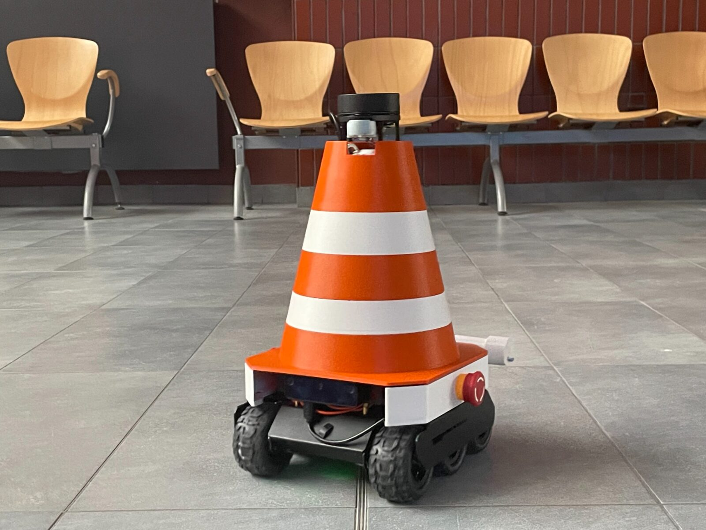
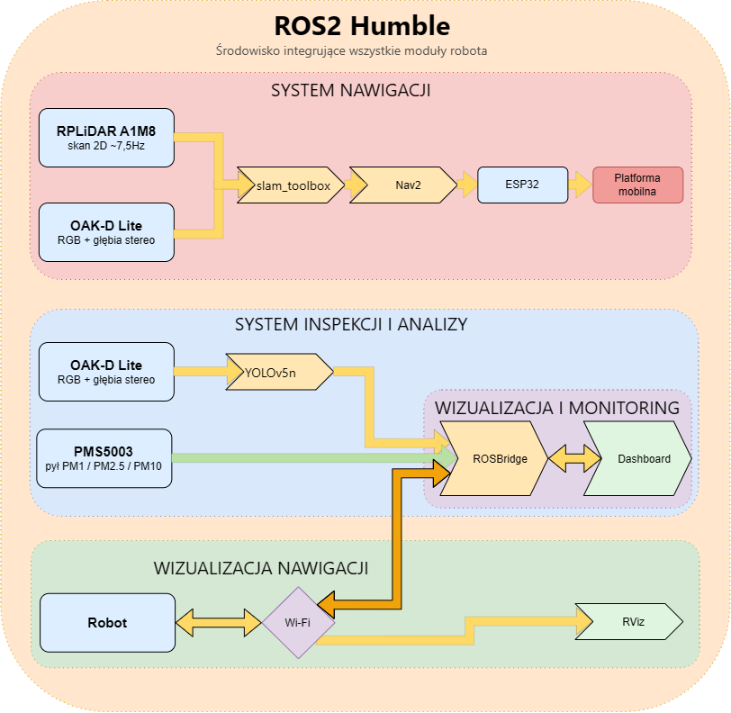
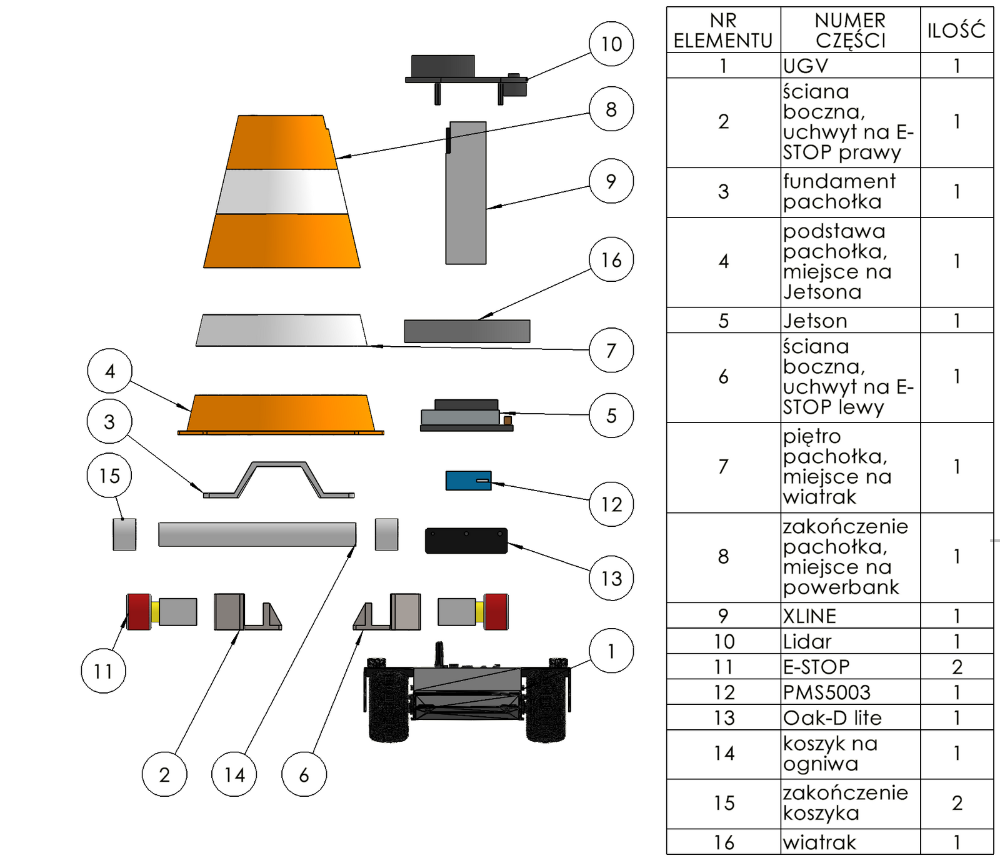
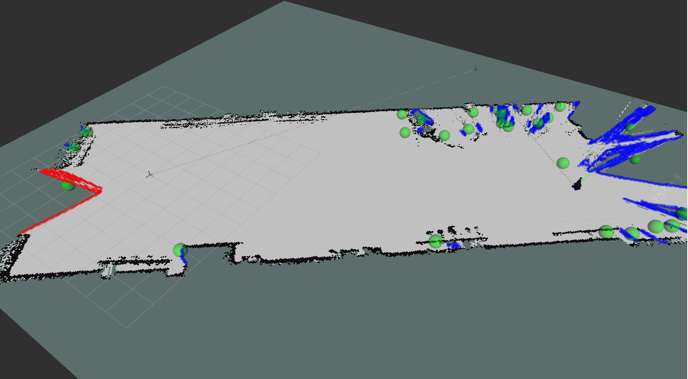
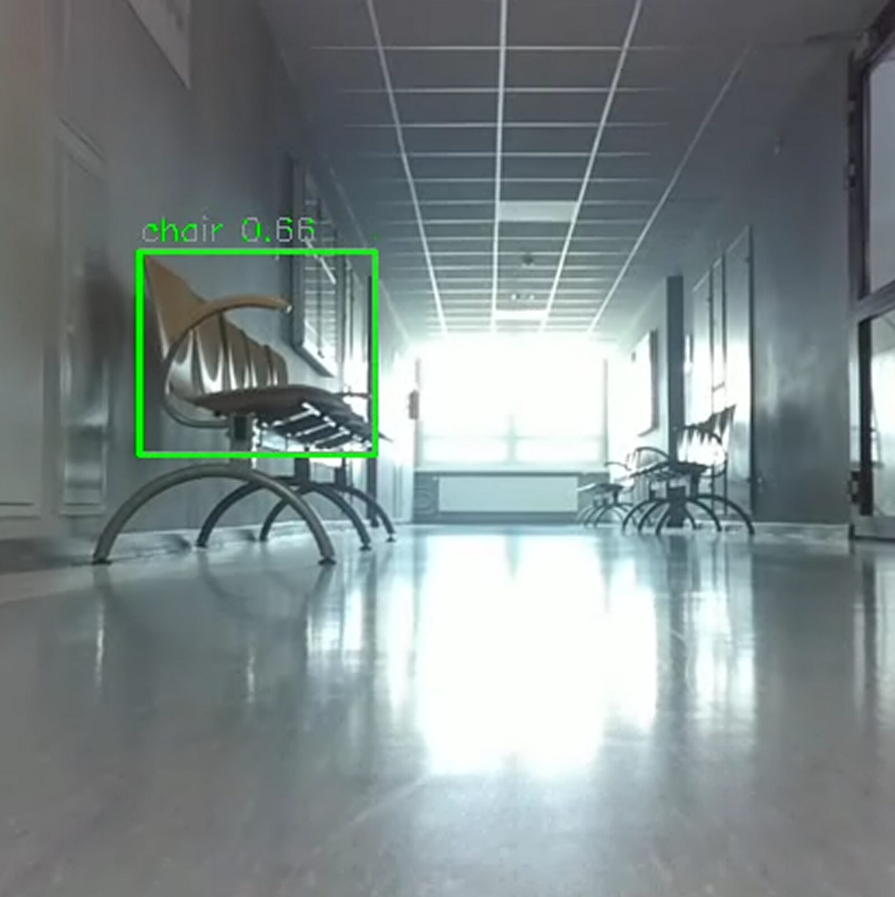
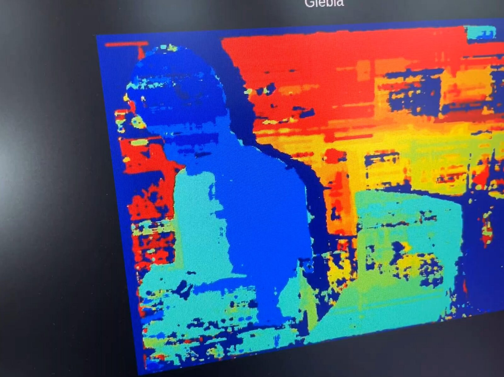
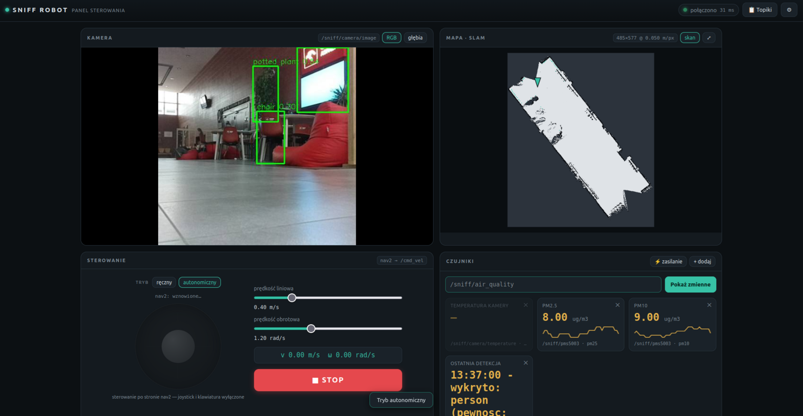
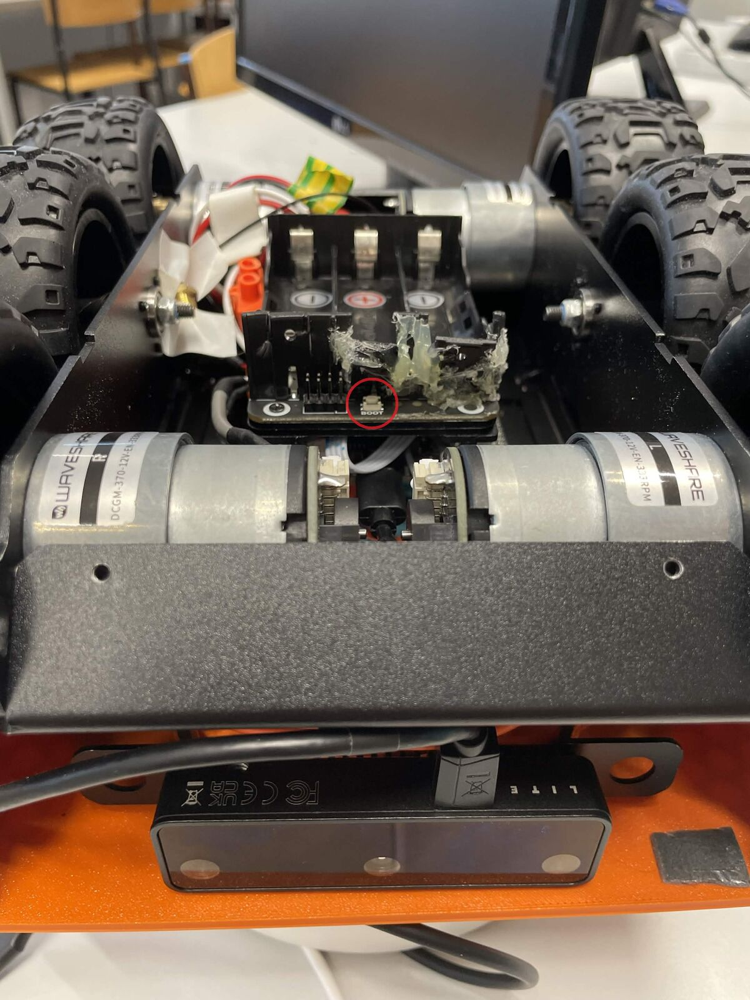

# SNIFF

## Sensor-based Navigation and Indoor Feature Finding



SNIFF to autonomiczny robot inspekcyjny opracowany w ramach programu Project Based Learning na Politechnice Poznańskiej.

System integruje autonomiczną nawigację, mapowanie pomieszczeń, detekcję obiektów oraz monitoring jakości powietrza w ramach jednej platformy mobilnej opartej o ROS2.

---

# Główne funkcjonalności

✅ autonomiczne mapowanie pomieszczeń (SLAM)

✅ lokalizacja robota na mapie

✅ autonomiczna nawigacja do wskazanego celu

✅ eksploracja nieznanego środowiska

✅ wykrywanie obiektów przy pomocy YOLOv5

✅ generowanie map głębi

✅ monitoring jakości powietrza

✅ zdalne sterowanie przez przeglądarkę internetową

✅ wizualizacja danych w RViz

---

# Architektura systemu



System został podzielony na trzy główne podsystemy:

### Nawigacja

- RPLiDAR A1M8
- OAK-D Lite
- slam_toolbox
- Navigation2 (Nav2)
- ESP32
- platforma mobilna UGV02

### Inspekcja i analiza

- kamera OAK-D Lite
- YOLOv5n
- PMS5003
- moduły autorskie ROS2

### Wizualizacja i sterowanie

- Dashboard WWW
- ROSBridge
- RViz

Wszystkie komponenty komunikują się poprzez ROS2 Humble.

---

# Sprzęt

| Komponent | Model |
|------------|---------|
| Platforma mobilna | Waveshare UGV02 |
| Komputer pokładowy | Jetson Orin Nano Super |
| Sterownik napędu | ESP32 |
| LiDAR | RPLiDAR A1M8 |
| Kamera | Luxonis OAK-D Lite |
| Czujnik jakości powietrza | PMS5003 |
| Zasilanie Jetsona | Powerbank USB-C 65 W |
| Napęd | 6x4 skid-steer |

---

# Struktura repozytorium

Poniżej przedstawiono najważniejsze elementy repozytorium projektu.

```text
sniff_robot-main
├── apps/
│   └── web_dashboard/          # panel operatorski WWW
│       ├── index.html
│       ├── app.js
│       ├── style.css
│       └── README.md
│
├── docker/
│   ├── jetson/                 # środowisko uruchomieniowe robota
│   └── laptop/                 # środowisko developerskie i symulacyjne
│
├── docs/
│   ├── pomiary_pid/            # dane z kalibracji napędu
│   └── SIMULATION_CHANGES.md
│
├── firmware/
│   ├── BACKUPY_BINARKA_ESP32_I_NVS_-_PRZECZYTAJ.md
│   └── zmiany_sniff_2026-08-04.patch
│
├── images/                     # grafiki wykorzystywane przez README
│
├── ros2_ws/
│   └── src/
│       │
│       ├── sniff_bringup/
│       │   ├── launch/
│       │   └── config/
│       │
│       ├── platform_control/
│       │   ├── launch/
│       │   └── platform_control/
│       │
│       ├── sniff_vision/
│       │   ├── models/
│       │   └── sniff_vision/
│       │
│       ├── sniff_sensors/
│       │   └── sniff_sensors/
│       │
│       ├── sniff_msgs/
│       │   └── msg/
│       │
│       ├── robot_description/
│       │   ├── config/
│       │   ├── meshes/
│       │   ├── rviz_conf/
│       │   ├── urdf/
│       │   └── worlds/
│       │
│       └── sllidar_ros2/
│
├── tools/
│   └── pid/                    # narzędzia do strojenia napędu
│
├── .gitignore
└── README.md
```

## Najważniejsze pakiety ROS2

| Pakiet | Funkcja |
|----------|----------|
| `sniff_bringup` | Uruchamianie i konfiguracja całego systemu robota |
| `platform_control` | Komunikacja z UGV, odometria, sterowanie napędem, patrolowanie |
| `sniff_vision` | Integracja kamery OAK-D Lite, detekcja YOLOv5, nagrywanie obrazu i analiza wizji |
| `sniff_sensors` | Obsługa czujnika jakości powietrza PMS5003 |
| `sniff_msgs` | Własne typy wiadomości ROS2 |
| `robot_description` | Model robota, konfiguracja Nav2, SLAM, RViz oraz światy Gazebo |
| `sllidar_ros2` | Sterownik i integracja lidaru RPLIDAR A1M8 |

## Kluczowe pliki konfiguracyjne

| Plik | Przeznaczenie |
|--------|--------|
| `full_bringup.launch.py` | Uruchomienie kompletnego systemu |
| `autonomy_bringup.launch.py` | Nawigacja autonomiczna |
| `web_bringup.launch.py` | Backend dashboardu WWW |
| `nav2_params.yaml` | Parametry Navigation2 |
| `slam_params_hw.yaml` | Parametry SLAM dla robota |
| `slam_params_sim.yaml` | Parametry SLAM dla środowiska symulacyjnego |
| `robot.urdf.xacro` | Model robota wykorzystywany przez ROS2 |
| `yolov5n.blob` | Model detekcji obiektów uruchamiany na OAK-D Lite |

# Konstrukcja robota

## Model CAD



Projekt obejmował opracowanie własnej obudowy drukowanej w technologii 3D.

Zaprojektowano dedykowane mocowania dla:

- Jetsona Orin Nano
- OAK-D Lite
- RPLiDAR A1M8
- PMS5003
- przycisków awaryjnego zatrzymania
- układów zasilania

---

# Wyniki działania

## Mapowanie środowiska



Robot wykorzystuje pakiet `slam_toolbox` do budowy map nieznanego środowiska.

Mapa tworzona jest w czasie rzeczywistym na podstawie danych z lidaru i kamery głębi.

---

## Widzenie maszynowe

### Detekcja obiektów




Rozpoznawanie obiektów realizowane jest przy pomocy sieci YOLOv5n uruchamianej bezpośrednio na procesorze wizyjnym kamery OAK-D Lite.

---

### Mapa głębi



Kamera OAK-D Lite generuje mapę głębi wykorzystywaną przez system percepcji oraz przez moduł autonomicznej nawigacji.

---

## Dashboard operatorski



Autorski panel operatorski umożliwia:

- sterowanie robotem,
- podgląd obrazu RGB,
- podgląd mapy głębi,
- podgląd mapy SLAM,
- monitoring PM1, PM2.5 i PM10,
- analizę logów detekcji,
- diagnostykę komunikacji ROS2.

---


# Szybki start

## Włączenie zasilania
* **Przyciski zasilania:** Przed uruchomieniem robota należy upewnić się, że:
  * przyciski awaryjne E-STOP są zwolnione,
  * platforma UGV została włączona przyciskiem zasilania,
  * po uruchomieniu platformy został naciśnięty przycisk **BOOT** znajdujący się na spodzie robota, w pobliżu koszyka na ogniwa. Bez wykonania tego kroku silniki platformy pozostaną nieaktywne.


<table align="center" width="100%">
  <tr>
    <td align="center" width="22%">
      
    </td>
    <td align="center" width="22%">
      
    </td>
    <td align="center" width="28%">
      
    </td>
    <td align="center" width="28%">
      
    </td>
  </tr>
  <tr>
    <td align="center" valign="top">
      <i>E-STOP aktywny (stan nieprawidłowy)</i>
    </td>
    <td align="center" valign="top">
      <i>E-STOP zwolniony (stan wymagany do pracy)</i>
    </td>
    <td align="center" valign="top">
      <i>Przycisk zasilania platformy UGV (srebrny, pozycja OFF)</i>
    </td>
    <td align="center" valign="top">
      <i>Przycisk BOOT aktywujący napęd platformy</i>
    </td>
  </tr>


</tr>
</table>


## Uruchomienie kontenera

### Komputer PC (wersja z symulacją)

```bash
cd docker/laptop
docker compose up -d
```

### Jetson (wersja produkcyjna)

```bash
cd docker/jetson
docker compose up -d
```

### Wejście do kontenera

```bash
docker exec -it sniff bash
```

---

# Uruchamianie systemu

Najprostszym sposobem uruchomienia całego robota jest:

```bash
ros2 launch sniff_bringup full_bringup.launch.py
```

---

# Najważniejsze pliki launch

| Plik | Opis |
|--------|--------|
| full_bringup.launch.py | Uruchomienie kompletnego systemu |
| lidar_bringup.launch.py | Obsługa lidaru |
| camera_bringup.launch.py | Obsługa kamery |
| web_bringup.launch.py | Dashboard WWW |
| navigation.launch.py | Moduły Nav2 |
| slam.launch.py | System mapowania |

---

# Dashboard WWW

## Backend

```bash
ros2 launch sniff_bringup web_bringup.launch.py
```

## Frontend

```bash
cd apps/web_dashboard
python3 -m http.server 8000
```

## Dostęp

W przeglądarce:

```text
http://IP_ROBOTA:8000
```

Adres IP można sprawdzić:

```bash
hostname -I
```

---

# Symulacja

Na komputerze hosta:

```bash
xhost +local:root
```

W kontenerze:

```bash
ros2 launch platform_control simulation.launch.py
```

---

# Eksploatacja i bezpieczeństwo

## Wyłączanie Jetsona

⚠️ Nigdy nie odłączaj powerbanku przed poprawnym zamknięciem systemu Linux.

Nagłe odcięcie zasilania może doprowadzić do uszkodzenia systemu plików.

Liczba reinstalowanego systemu Linux z tego powodu: 1

---

## Akumulatory platformy

Po zakończeniu pracy należy wyjąć ogniwa z platformy UGV.

Pozostawienie ich wewnątrz robota może powodować ich głębokie rozładowanie przez układ ESP32.

---

## Przyciski bezpieczeństwa

Przed uruchomieniem robota należy upewnić się, że:

- przycisk UGV jest wciśnięty,
- oba przyciski E-STOP są zwolnione.

---

# Rozwiązywanie problemów

## LiDAR nie działa

### Objawy

- brak mapowania,
- brak danych `/scan`,
- błędy RPLIDAR.

### Możliwe przyczyny

- zmiana numerów portów USB,
- uszkodzone przewody,
- nieprawidłowe podłączenie urządzeń.

### Rozwiązanie

Sprawdź aktualne porty:

```bash
ls /dev/ttyUSB*
```

Możesz wymusić porty podczas uruchomienia:

```bash
ros2 launch sniff_bringup full_bringup.launch.py \
    serial_port:='/dev/ttyUSB1' \
    sensor_port:='/dev/ttyUSB0'
```
### Prewencja

Zaleca się dostosowanie do uprzednio przyjętego ułożenia wpięcia przewodów USB:
<p align="center">
  
  
  <figcaption align="center">
    <i>Kable USB oraz schemat ich łączenia z Jetsonem.</i>
  </figcaption>
</p>

---

## Problemy z nawigacją

### Objawy

- robot nie planuje trasy,
- brak ruchu po wskazaniu celu,
- niepoprawne zachowanie Nav2,
- robot wyznaczył cel zbyt blisko obecnego położenia.

### Rozwiązanie

Porusz robotem używając trybu ręcznego w Dashboard, następnie przełącz na tryb autonomiczny.

### Prewencja

Uruchamiaj system przy użyciu:

```bash
ros2 launch sniff_bringup full_bringup.launch.py
```

Zapewnia to poprawną kolejność startu wszystkich zależnych komponentów.

---

# Stan projektu

| Funkcja | Status |
|----------|----------|
| Odometria | ✅ |
| SLAM | ✅ |
| Nav2 | ✅ |
| Eksploracja | ✅ |
| Dashboard WWW | ✅ |
| Detekcja YOLO | ✅ |
| PMS5003 | ✅ |
| Autonomiczna jazda | ✅ |
| SCD40 (CO₂) | ❌ |

---

# Autorzy

- Grzegorz Budzyński
- Adam Lamecki
- Danylo Chernomorets
- Konrad Anczyk

Politechnika Poznańska  
Project Based Learning (PBL)