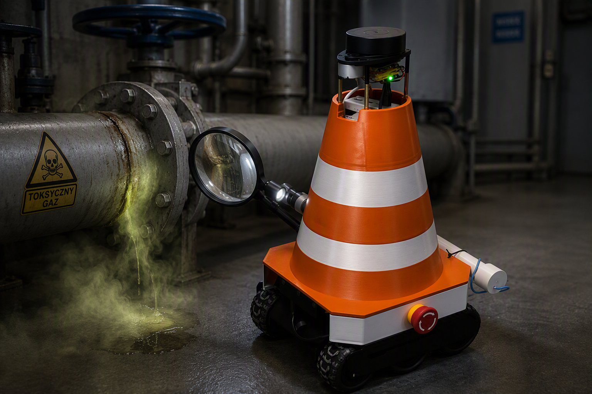
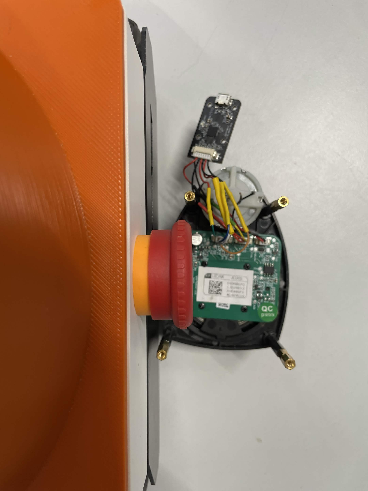
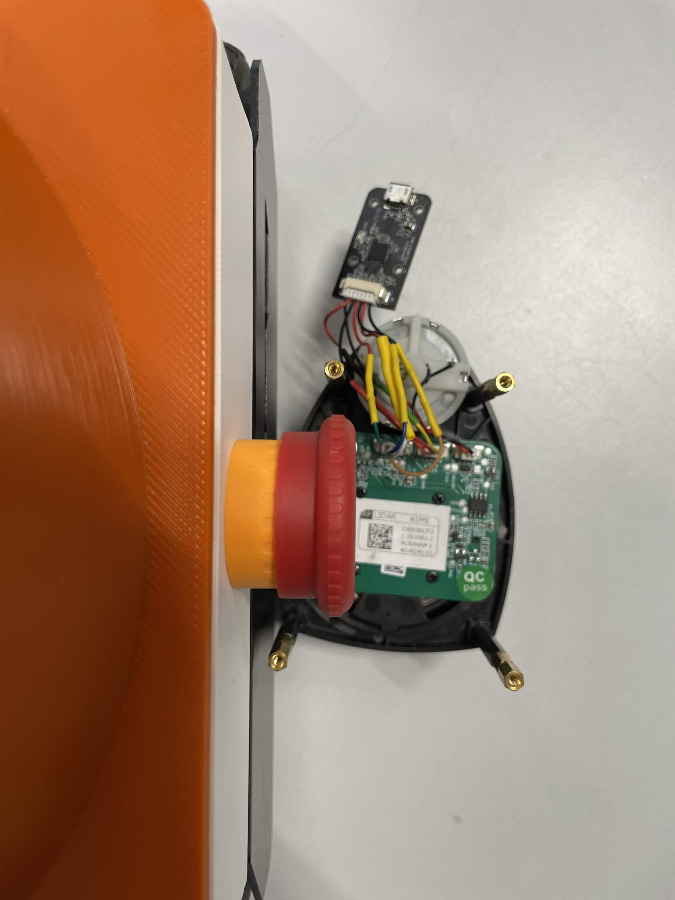
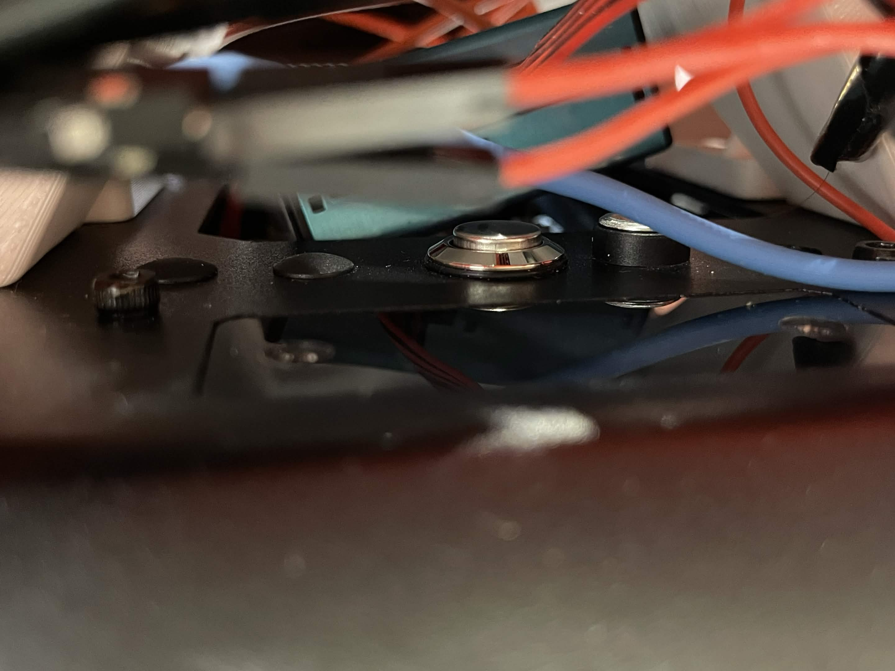
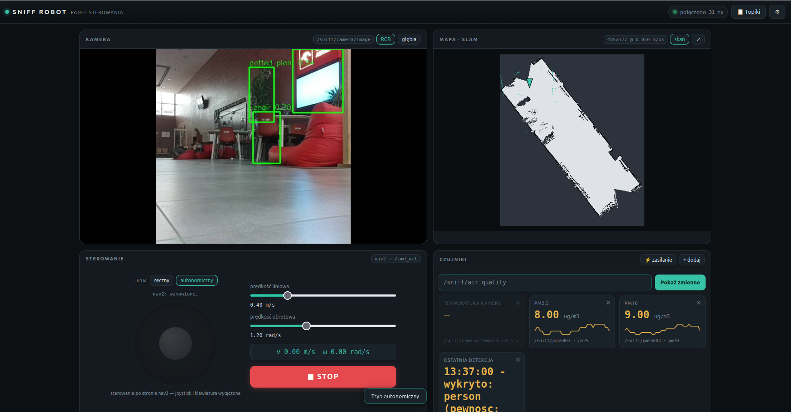
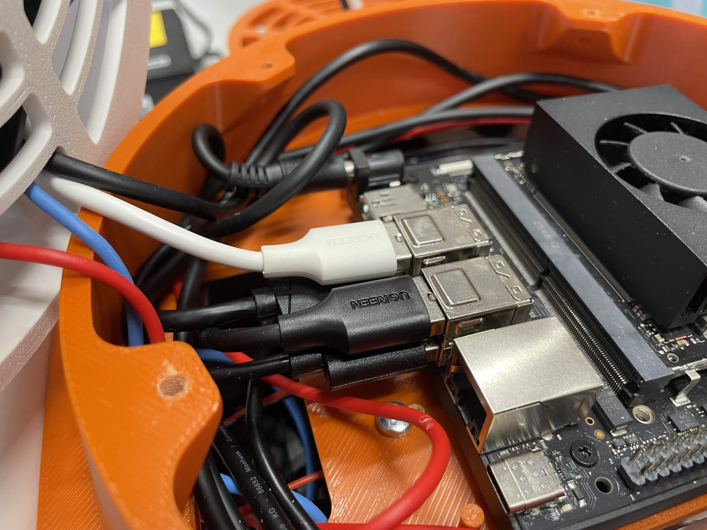
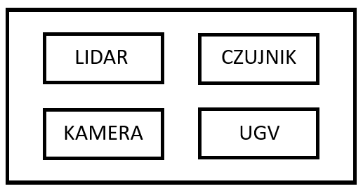
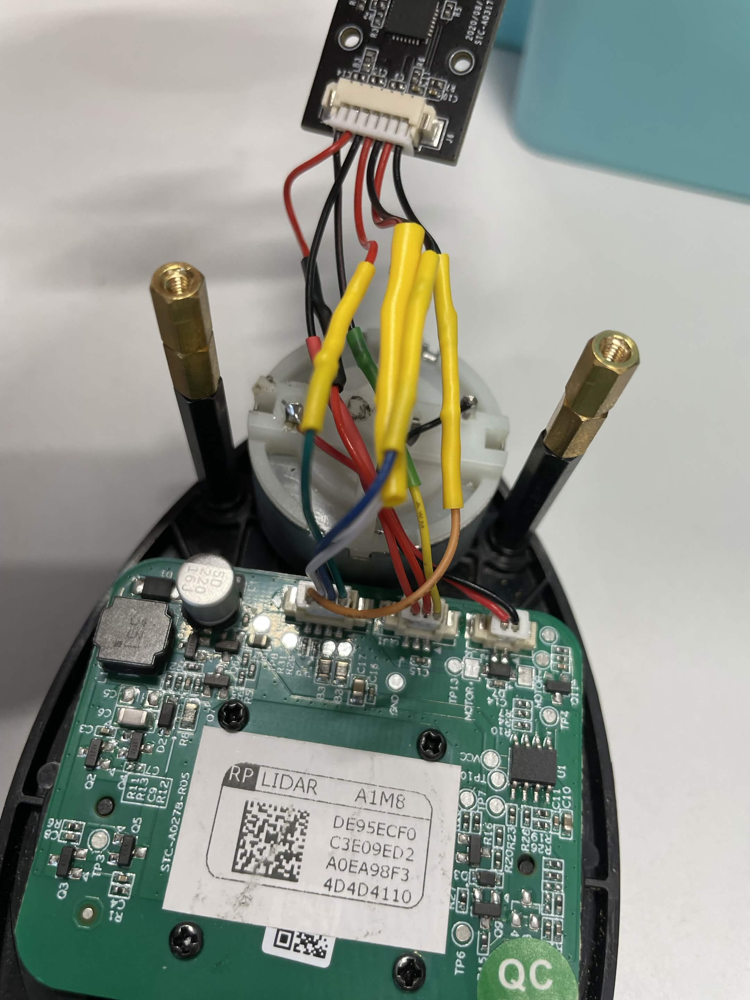

# SNIFF (Sensor-based Navigation and Indoor Feature Finding)




## O projekcie i działaniu robota
**SNIFF** to zaawansowany robot mobilny przeznaczony do w pełni autonomicznej inspekcji wewnątrz budynków. Jego głównym zadaniem jest ciągłe patrolowanie przestrzeni. Dzięki wbudowanym czujnikom robot potrafi wykryć lokalne niebezpieczeństwa, takie jak nieprawidłowo wysokie stężenie CO2 lub szkodliwych pyłów.

---

## ⚠️ Ważne ostrzeżenia i zalecenia

Aby uniknąć uszkodzenia sprzętu, przed rozpoczęciem pracy z robotem zapoznaj się z poniższymi zasadami:

### Zasilanie i sprzęt
*   **Wyłączanie Jetsona:** 🔴 **NIGDY** nie odłączaj powerbanka, dopóki komputer Jetson nie zostanie w pełni i poprawnie wyłączony! Nagłe odcięcie zasilania może uszkodzić system plików.
*   **Rozładowanie baterii UGV:** Zawsze wyciągaj ogniwa z platformy jezdnej (UGV), gdy skończysz pracę. Pozostawienie ich w środku może doprowadzić do głębokiego rozładowania baterii przez pracujący układ ESP32.
*   **Porty USB:** Zaleca się bezwzględne zachowanie obecnego podłączenia peryferiów przez porty USB. Zmiana portów może powodować problemy z mapowaniem sprzętu w systemie operacyjnym.
* **Przyciski zasilania:** Przed uruchomieniem aplikacji należy upewnić się, czy przycisk UGV jest **WCIŚNIĘTY**, a grzybki zabezpieczające **WYCIĄGNIĘTE**.
<table align="center" width="100%">
  <!-- Pierwszy wiersz: TYLKO ZDJĘCIA -->
  <tr>
    <td align="center" width="30%" valign="bottom">
      
    </td>
    <td align="center" width="30%" valign="bottom">
      
    </td>
    <td align="center" width="40%" valign="bottom">
      
    </td>
  </tr>
  
  <!-- Drugi wiersz: TYLKO PODPISY -->
  <tr>
    <td align="center" valign="top">
      <i>Wciśnięty przycisk zabezpieczający</i>
    </td>
    <td align="center" valign="top">
      <i>Zwolniony przycisk zabezpieczający</i>
    </td>
    <td align="center" valign="top">
      <i>Przycisk do załączenia UGV (znajduje się na tylnej części robota) </i>
    </td>
  </tr>
</table>


### Sieć
*   **Nowe Wi-Fi:** Pierwsze podłączenie robota do nowej sieci Wi-Fi będzie wymagało fizycznego podłączenia komputera Jetson do zewnętrznego monitora oraz klawiatury.

---

## 🚀 Uruchamianie i użyteczne komendy

### 1. Uruchamianie za pomocą Dockera

Zalecanym sposobem pracy z projektem jest wykorzystanie konteneryzacji. W repozytorium znajdziesz różne pliki konfiguracyjne Dockera, które różnią się przede wszystkim **obecnością środowiska symulacyjnego**.

*   **Wersja z symulacją (/docker/laptop):** Zawiera pakiety niezbędne do symulacji (takie jak środowisko Gazebo). Jest przeznaczona głównie do uruchamiania na Twoim komputerze (host/PC) w celu testowania kodu bez użycia fizycznego robota.
*   **Wersja bez symulacji (/docker/jetson):** Lekka, zoptymalizowana wersja pozbawiona narzędzi symulacyjnych. Jest przeznaczona do uruchamiania bezpośrednio na komputerze robota (Nvidia Jetson).

**Jak uruchomić kontenery?**
*(Uwaga: wstaw poniżej właściwe nazwy swoich plików Dockerfile lub docker-compose)*

```bash
# Zbudowanie i uruchomienie kontenera Z SYMULACJĄ (na komputerze PC):
cd docker/laptop/
docker compose up -d

# Zbudowanie i uruchomienie kontenera BEZ SYMULACJI (na Jetsonie):
cd docker/jetson/
docker compose up -d

# Wejście do uruchomionego kontenera (aby wpisywać komendy ROS 2):
docker exec -it nazwa_kontenera bash
```

### 2. Moduły sprzętowe (sniff_bringup)
Głównym narzędziem do uruchamiania węzłów (node'ów) robota jest paczka `sniff_bringup`. Użyj poniższej komendy, podmieniając `<plik.launch>` na odpowiedni skrypt z tabeli:

```bash
ros2 launch sniff_bringup <plik.launch>
```

| Plik `.launch` | Opis działania |
|---|---|
| `full_bringup.launch.py` | Uruchamia **wszystkie** niezbędne node'y do pełnego działania robota. |
| `lidar_bringup.launch.py` | Uruchamia tylko node odpowiedzialny za komunikację z lidarem. |
| `camera_bringup.launch.py` | Uruchamia tylko node odpowiedzialny za obsługę kamery. |
| `web_bringup.launch.py` | Uruchamia backend strony internetowej (dashboardu). |

**⚠️ Uwaga na konflikty:** Uważaj na wielokrotne uruchamianie tych samych node'ów (węzłów) – w razie potrzeby w plikach launch istnieje możliwość wyłączenia startu wybranych z nich. Na przykład:

```bash
ros2 launch sniff_bringup full_bringup use_camera:='false'
```

### 3. Uruchomienie Strony Internetowej (Dashboard)
**⚠️ Uwaga:** Wszystkie urządzenia (komputer sterujący, telefon, robot) muszą znajdować się w tej samej sieci Wi-Fi/LAN.

Aby sprawdzić adres IP robota (hosta), wpisz w jego terminalu:
```bash
hostname -I
```

**Kroki uruchamiania panelu:**
1. **W kontenerze ROS 2 (backend):**
   ```bash
   ros2 launch sniff_bringup web_bringup.launch.py
   ```
2. **Serwowanie strony z hosta (frontend):**
   Uruchom w nowym terminalu na hoście:
   ```bash
   cd apps/web_dashboard
   python3 -m http.server 8000
   ```
3. **W przeglądarce internetowej:**
   Wpisz w pasku adresu:
   `http://<IP_HOSTA>:8000`




### 4. Symulacja
Aby przetestować zachowanie robota i algorytmy w środowisku symulowanym, użyj poniższych komend:
```bash
# Na hoście
xhost +local:root

# Wewnątrz kontenera
ros2 launch platform_control simulation.launch.py 
```

---

## 🛠️ Rozwiązywanie problemów (Troubleshooting)

<p align="center">
  
  
  <figcaption align="center">
    <i>Kable USB oraz schemat ich łączenia z Jetsonem.</i>
  </figcaption>
</p>

Poniżej znajduje się lista najczęstszych problemów i sposoby na ich szybkie rozwiązanie:

### Problem 1: Mapowanie nie działa / Brak połączenia z lidarem
*   **Przyczyna:** Porty czujnika (np. jakości powietrza) oraz lidara mogą się losowo zamieniać numerami w systemie Linux (np. `/dev/ttyUSB0` z `/dev/ttyUSB1`). Dzieje się tak, ponieważ oba te moduły korzystają z tego samego modelu konwertera UART-USB.
*   **Rozwiązanie:** Przepnij kable USB zgodnie z rekomendowanym schematem, lub zrestartuj system. Upewnij się, że zachowujesz obecne, zalecane podłączenie peryferiów do fizycznych portów. Również można programowo zmienić port urządzenia, wpisując jako argument startowy: *serial_port* dla lidara (domyślnie /dev/ttyUSB0), *sensor_port* dla czujnika (domyślnie /dev/ttyUSB1).
```bash
ros2 launch sniff_bringup full_bringup serial_port:='/dev/ttyUSB1' sensor_port:='/dev/ttyUSB0'
```

*   **Dodatkowa uwaga dot. sprzętu:** W przeszłości występowały sprzętowe problemy z lidarem wymagające wymiany kabelków. Jeśli porty w systemie przypisane są poprawnie, a lidar nadal nie reaguje, sprawdź ciągłość i jakość połączeń przewodów.

<p align="center">
   
</p>

### Problem 2: Nieprawidłowe zachowanie podczas autonomicznej jazdy
*   **Przyczyna:** Poszczególne moduły sterowania i mapowania mogły zostać uruchomione w złej kolejności lub brakuje któregoś z kluczowych node'ów nawigacyjnych.
*   **Rozwiązanie:** Najlepszym sposobem na uniknięcie tego błędu jest użycie głównego pliku startowego, który sam dba o synchronizację: wpisz `ros2 launch sniff_bringup full_bringup.launch.py`. Jeśli musisz uruchamiać poszczególne elementy oddzielnie ze względów diagnostycznych (np. sam lidar, potem platformę), upewnij się, że zachowujesz odpowiednią kolejność zależną (np. najpierw podwozie i czujniki, a dopiero potem node nawigacyjny).